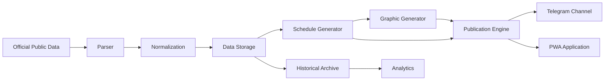

# SvitloSk Specification (SSP)


> **Official Technical Specification of the SvitloSk Project**

SvitloSk is an **Automated Open Data Information System** designed to collect, process and publish official information about electricity outages for residents of the **Starokostiantyniv Territorial Community (Ukraine)**.

This repository contains the official specification governing the architecture, engineering principles, technical standards and documentation of the SvitloSk project.

---

# Why SvitloSk?

Public utilities publish large volumes of official information every day.

For ordinary residents this information is often:

- difficult to locate;
- difficult to understand;
- fragmented across multiple sources;
- inconvenient for everyday use.

SvitloSk solves this problem.

The system continuously processes official public data and automatically transforms it into clear, structured and accessible information without changing the meaning of the original source.

The project demonstrates how open data can become a practical public service.

---

# Official Definition

> **SvitloSk is an Automated Open Data Information System that continuously processes official public information about electricity outages and delivers understandable, structured and timely information to residents of the Starokostiantyniv Territorial Community through automated digital services.**

---

# Mission

Transform complex official electricity outage information into reliable, understandable and freely accessible public information while preserving transparency, accuracy and respect for official open data.

---

# Vision

SvitloSk aims to become a reference implementation of a community-level public information platform based entirely on official open data.

Although the architecture is designed to be reusable, the current project is dedicated exclusively to the **Starokostiantyniv Territorial Community**.

---

# Project Values

The project is guided by the following values.

- Transparency
- Simplicity
- Accuracy
- Respect for official public data
- Automation
- Determinism
- Reliability
- Maintainability
- Accessibility
- Engineering discipline

---

# Design Philosophy

SvitloSk follows several fundamental engineering principles.

## One document — one complete idea

Each document has one clearly defined responsibility.

---

## Deterministic processing

The same input shall always produce the same output.

---

## Respect for open data

Official public information is never modified.

Only its presentation is improved.

---

## Automation first

Every repeatable process should eventually become automated.

---

## Organic evolution

The specification grows by extending the existing architecture rather than replacing it.

---

## Stable specifications

Published specifications remain stable.

Architectural changes require documented decisions.

---

# System Architecture



---

# Repository Structure

```
.
├── specification/
│   ├── SSP-001-Data-Pipeline.md
│   ├── SSP-002-Parser.md
│   ├── SSP-003-Publication-Engine.md
│   ├── SSP-004-Telegram-Channel.md
│   ├── SSP-005-Data-Storage.md
│   ├── SSP-006-Schedule-Generator.md
│   ├── SSP-007-Graphic-Generator.md
│   ├── SSP-008-API.md
│   ├── SSP-009-Configuration.md
│   ├── SSP-010-Logging.md
│   ├── SSP-011-Monitoring.md
│   ├── SSP-012-Security.md
│   └── SSP-013-Deployment.md
│
├── README.md
├── CHARTER.md
├── PROJECT_PRINCIPLES.md
├── ARCHITECTURE.md
├── SYSTEM_OVERVIEW.md
├── DATA_MODEL.md
├── GLOSSARY.md
├── RFC_PROCESS.md
├── EDITORIAL_STANDARDS.md
├── DOCUMENT_INDEX.md
└── LICENSE
```

---

# Documentation

## Repository Documents

| Document | Purpose |
|----------|---------|
| [README.md](README.md) | Repository overview |
| [CHARTER.md](CHARTER.md) | Project charter |
| [PROJECT_PRINCIPLES.md](PROJECT_PRINCIPLES.md) | Engineering principles |
| [ARCHITECTURE.md](ARCHITECTURE.md) | Overall architecture |
| [SYSTEM_OVERVIEW.md](SYSTEM_OVERVIEW.md) | High-level system description |
| [DATA_MODEL.md](DATA_MODEL.md) | Data model |
| [GLOSSARY.md](GLOSSARY.md) | Official terminology |
| [RFC_PROCESS.md](RFC_PROCESS.md) | RFC workflow |
| [EDITORIAL_STANDARDS.md](EDITORIAL_STANDARDS.md) | Documentation rules |
| [DOCUMENT_INDEX.md](DOCUMENT_INDEX.md) | Documentation index |

---

## Technical Specifications

| Specification | Description |
|--------------|-------------|
| SSP-001 | Data Pipeline |
| SSP-002 | Parser |
| SSP-003 | Publication Engine |
| SSP-004 | Telegram Channel |
| SSP-005 | Data Storage |
| SSP-006 | Schedule Generator |
| SSP-007 | Graphic Generator |
| SSP-008 | Internal API |
| SSP-009 | Configuration |
| SSP-010 | Logging |
| SSP-011 | Monitoring |
| SSP-012 | Security |
| SSP-013 | Deployment |

---

# Open Data Principles

SvitloSk is built upon official public information.

The system:

- never alters source information;
- preserves official meaning;
- records processing steps;
- generates derived information transparently;
- maintains historical consistency.

---

# Current Status

Current development stage:

**Core Specification Completed**

The repository currently contains the complete Core Specification describing the architecture and engineering standards of the SvitloSk platform.

---

# Roadmap

Current priorities:

- Repository audit
- Editorial review
- Ukrainian documentation
- Extended specifications
- Reference implementation
- Public release

---

# Contributing

The repository currently serves as the official project specification.

Contribution guidelines will be published after Specification Version 1.0.

---

# License

Distributed under the terms of the MIT License.

See [LICENSE](LICENSE).

---

# Project Status

Active Development

---

© SvitloSk Project
